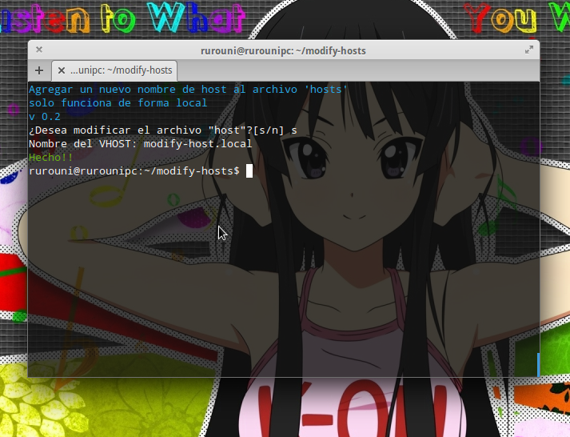

##Modify host
v 1.0.0

Este es un programa que ayuda a modificar el archivo `hosts` de nuestro sistema Linux.


#### Antes de comenzar
Es necesario tener `php` instalado y usable con una llamada en consola.

También es necesario tener instalado composer o instalarlo.

Pueden visitar la página de composer [getcomposer](https://getcomposer.org/doc/00-intro.md#installation-nix) o usar el siguiente comando

```
php -r "readfile('https://getcomposer.org/installer');" | php
```
Finalmente se instalan las dependencias
```
./composer.phar install
```

#### Uso

```
sudo ./modify-host
```

Para mostrar una ayuda simple
```
sudo ./modify-host -h
```

### Pendiente por hacer
* ~~Agregar un nuevo nombre de vHost~~
* Eliminar un nombre de vHost

### Screenshots




### Licencia

Los archivos en este proyecto se encuentran regidos sobre la licencia BSD-3
[License.txt](license.txt) en español [License-es.txt](license-es.txt)
